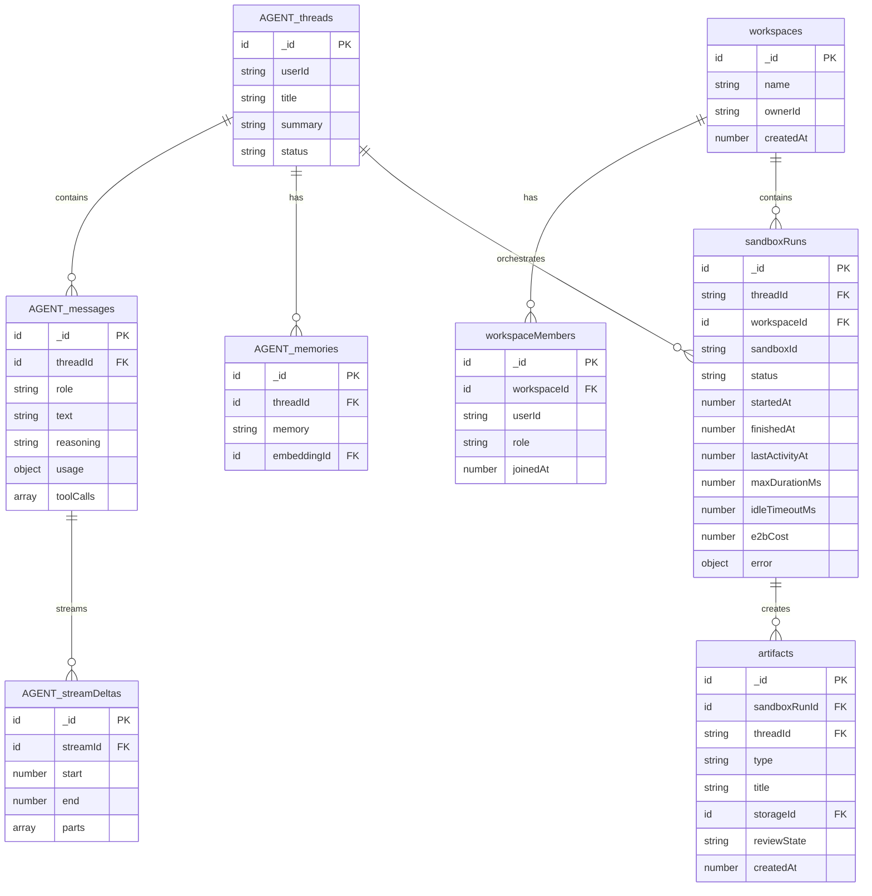

# Convex Integration Plan

> Transform this boilerplate into a standardized, opinionated framework for spinning up Claude SDK agents in E2B sandboxes with session persistence, memory, real-time UI streaming, and backend observability.

**Status**: Ready for Implementation
**Created**: 2026-01-08
**Updated**: 2026-01-08 (Configuration decisions finalized)
**Complexity**: MORE (Standard - Leveraging existing component)

---

## Executive Summary

This plan integrates Convex as the system-of-record using the **`@convex-dev/agent` component** for threads, messages, and streaming, plus **4 custom tables** for multi-tenant workspaces and E2B orchestration. This approach gets us 80% of functionality immediately while maintaining full control over E2B-specific features.

### Architecture Decision

| Approach | Decision |
|----------|----------|
| Use `@convex-dev/agent` | **Yes** - Provides threads, messages, streaming, reasoning, files, search, memories |
| Custom tables | **4 tables** - workspaces, workspaceMembers, sandboxRuns, artifacts |
| Braintrust | **Keep** - Out-of-band telemetry, evals, traces (unchanged) |
| Sandbox lifecycle | **Simple** - Running → kill after 15min idle (no pause/resume for MVP) |

### What `@convex-dev/agent` Gives Us For Free

| Feature | How It Works |
|---------|--------------|
| Thread persistence | `threads` table with status, summary, parent threads |
| Message storage | `messages` with reasoning, sources, usage, tool calls |
| Real-time streaming | WebSocket-based `streamDeltas` (no SSE needed!) |
| Semantic memory | `memories` table with vector embeddings |
| File handling | `files` table with deduplication and ref-counting |
| Search | Hybrid vector/text search across messages |
| Usage tracking | Per-provider, per-model, per-user attribution |

---

## Architecture Overview

```
┌─────────────────────────────────────────────────────────────┐
│   Next.js Frontend                                          │
│   - useQuery("getRun") for real-time status                 │
│   - useQuery("getEvents") for streaming display             │
│   - useMutation("startRun") to trigger agent                │
└──────────────────┬──────────────────────────────────────────┘
                   │ Convex Subscriptions (WebSocket)
                   ↓
┌─────────────────────────────────────────────────────────────┐
│   Convex Backend (System of Record)                         │
│   - conversations, runs, events, checkpoints tables         │
│   - Real-time subscriptions for UI                          │
│   - Scheduled functions for retries/timeouts                │
│   - HTTP Actions for E2B callbacks                          │
└──────────────────┬──────────────────────────────────────────┘
                   │ Convex Actions (trigger E2B)
                   ↓
┌─────────────────────────────────────────────────────────────┐
│   E2B Sandbox (Python Runtime)                              │
│   - Claude Agent SDK                                        │
│   - Posts events to Convex HTTP endpoint                    │
│   - Creates checkpoints for HITL                            │
└──────────────────┬──────────────────────────────────────────┘
                   │ Braintrust SDK (telemetry)
                   ↓
┌─────────────────────────────────────────────────────────────┐
│   Braintrust (Out-of-band Telemetry)                        │
│   - Full prompts, tool I/O, token counts                    │
│   - NOT for UI state (Convex handles that)                  │
└─────────────────────────────────────────────────────────────┘
```

---

## Data Model: @convex-dev/agent + 4 Custom Tables

### Component Installation

```typescript
// convex/convex.config.ts
import { defineApp } from "convex/server";
import agent from "@convex-dev/agent/convex.config.js";

const app = defineApp();
app.use(agent);  // Installs agent component with its own isolated tables
export default app;
```

### What the Agent Component Provides (Don't Recreate These)

The `@convex-dev/agent` component manages these tables internally:

| Table | Fields | Purpose |
|-------|--------|---------|
| `threads` | userId, title, summary, status, parentThreadIds | Conversation containers |
| `messages` | threadId, role, text, reasoning, reasoningDetails, sources, usage, toolCalls | All messages with full context |
| `streamingMessages` | threadId, state (streaming/finished/aborted), format | Active streams |
| `streamDeltas` | streamId, start, end, parts | Real-time chunks |
| `memories` | threadId, userId, memory, embeddingId | Semantic memory |
| `files` | storageId, mimeType, filename, hash, refcount | File storage |

### Your Custom Tables (4 Tables)

```typescript
// convex/schema.ts - YOUR custom tables alongside @convex-dev/agent
import { defineSchema, defineTable } from "convex/server";
import { v } from "convex/values";

export default defineSchema({
  // ============================================
  // 1. WORKSPACES (Multi-Tenant)
  // ============================================

  workspaces: defineTable({
    name: v.string(),
    ownerId: v.string(), // tokenIdentifier from auth
    createdAt: v.number(),
  }),

  // ============================================
  // 2. WORKSPACE MEMBERS (Permissions)
  // ============================================

  workspaceMembers: defineTable({
    workspaceId: v.id("workspaces"),
    userId: v.string(), // tokenIdentifier
    role: v.union(
      v.literal("owner"),
      v.literal("admin"),
      v.literal("member")
    ),
    joinedAt: v.number(),
  })
    .index("by_user", ["userId"])
    .index("by_workspace", ["workspaceId"]),

  // ============================================
  // 3. SANDBOX RUNS (E2B Orchestration)
  // Links agent threads to E2B sandboxes
  // Simple lifecycle: running → kill after 15min idle
  // ============================================

  sandboxRuns: defineTable({
    // Link to @convex-dev/agent thread
    threadId: v.string(),

    // Multi-tenant
    workspaceId: v.id("workspaces"),
    createdBy: v.string(),

    // E2B sandbox lifecycle (simple: no pause/resume)
    sandboxId: v.optional(v.string()),
    status: v.union(
      v.literal("booting"),
      v.literal("running"),
      v.literal("succeeded"),
      v.literal("failed"),
      v.literal("canceled")
    ),

    // Timing
    startedAt: v.number(),
    finishedAt: v.optional(v.number()),
    lastActivityAt: v.optional(v.number()),  // For idle timeout detection

    // Configurable limits
    maxDurationMs: v.optional(v.number()),   // Max run duration (default: 1 hour)
    idleTimeoutMs: v.optional(v.number()),   // Kill after idle (default: 15 min)

    // E2B-specific cost (Claude cost tracked in agent component)
    e2bCost: v.optional(v.number()),

    // Error info
    error: v.optional(v.object({
      code: v.string(),
      message: v.string(),
      retriable: v.boolean(),
    })),
  })
    .index("by_thread", ["threadId"])
    .index("by_workspace", ["workspaceId"])
    .index("by_status", ["status"]),

  // ============================================
  // 4. ARTIFACTS (Review Workflow)
  // For files that need user approval
  // ============================================

  artifacts: defineTable({
    sandboxRunId: v.id("sandboxRuns"),
    threadId: v.string(), // Link to agent thread

    // What was created
    type: v.string(), // "code", "document", "image", "data"
    title: v.string(),

    // Storage (uses Convex file storage)
    storageId: v.id("_storage"),
    contentType: v.string(),
    size: v.number(),

    // Where it lives in sandbox (for checkpoint restoration)
    sandboxPath: v.optional(v.string()),

    // Preview for UI
    previewText: v.optional(v.string()),

    // Review workflow
    reviewState: v.union(
      v.literal("pending"),
      v.literal("approved"),
      v.literal("rejected")
    ),
    reviewedBy: v.optional(v.string()),
    reviewedAt: v.optional(v.number()),

    createdAt: v.number(),
  })
    .index("by_run", ["sandboxRunId"])
    .index("by_thread", ["threadId"])
    .index("by_review_state", ["reviewState"]),
});
```

---

## Sandbox Run State Machine

```
┌──────────────┐
│   booting    │ ← E2B sandbox starting
└──────┬───────┘
       │ sandbox ready
       ↓
┌──────────────┐
│   running    │ ← Agent executing (stays running while user interacts)
└───┬──────────┘
    │
    ├───────────────→ succeeded (terminal) - user ends session
    ├───────────────→ failed (terminal) - error occurred
    ├───────────────→ canceled (terminal) - 15min idle timeout OR user cancels
    │
```

### Sandbox Lifecycle Strategy (Simple)

For MVP, we keep it simple - no pause/resume complexity:

1. **Sandbox stays running** while user is in session
2. **Cron job** checks for idle sandboxes every 30 seconds
3. **Kill after 15 minutes** of inactivity (no heartbeat/activity)
4. **New sandbox** if user comes back after timeout

**Cost**: ~$0.025 for 15 minutes idle (acceptable for MVP)

**Future optimization**: Add pause/resume when costs matter at scale (E2B has beta support for this).

### Transition Validation

```typescript
// convex/lib/stateMachine.ts
const VALID_TRANSITIONS: Record<string, string[]> = {
  booting: ["running", "failed", "canceled"],
  running: ["succeeded", "failed", "canceled"],
  // Terminal states
  succeeded: [],
  failed: [],
  canceled: [],
};

export function validateTransition(from: string, to: string): boolean {
  return VALID_TRANSITIONS[from]?.includes(to) ?? false;
}
```

---

## How E2B Integrates with @convex-dev/agent

The agent component handles messaging/streaming. Your custom `sandboxRuns` table tracks E2B lifecycle:

```typescript
// convex/actions/startSandboxRun.ts
"use node";

import { action } from "./_generated/server";
import { internal } from "./_generated/api";
import { v } from "convex/values";
import { Sandbox } from "@e2b/code-interpreter";

const DEFAULT_MAX_DURATION_MS = 60 * 60 * 1000;  // 1 hour
const DEFAULT_IDLE_TIMEOUT_MS = 15 * 60 * 1000;  // 15 minutes

export const startSandboxRun = action({
  args: {
    threadId: v.string(),
    workspaceId: v.id("workspaces"),
    prompt: v.string(),
    maxDurationMs: v.optional(v.number()),
  },
  handler: async (ctx, args) => {
    const now = Date.now();

    // 1. Create sandboxRun record
    const sandboxRunId = await ctx.runMutation(internal.sandboxRuns.create, {
      threadId: args.threadId,
      workspaceId: args.workspaceId,
      status: "booting",
      startedAt: now,
      lastActivityAt: now,
      maxDurationMs: args.maxDurationMs ?? DEFAULT_MAX_DURATION_MS,
      idleTimeoutMs: DEFAULT_IDLE_TIMEOUT_MS,
    });

    try {
      // 2. Create E2B sandbox
      const sandbox = await Sandbox.create(process.env.E2B_TEMPLATE_ID!);

      // 3. Update with sandboxId
      await ctx.runMutation(internal.sandboxRuns.update, {
        sandboxRunId,
        sandboxId: sandbox.sandboxId,
        status: "running",
      });

      // 4. Execute agent using @convex-dev/agent
      // The agent component handles message storage and streaming
      // Update lastActivityAt on each interaction to prevent idle timeout

      // ... agent execution logic ...

      // 5. On completion:
      await ctx.runMutation(internal.sandboxRuns.update, {
        sandboxRunId,
        status: "succeeded",
        finishedAt: Date.now(),
      });

      await sandbox.kill();

    } catch (error) {
      await ctx.runMutation(internal.sandboxRuns.update, {
        sandboxRunId,
        status: "failed",
        error: { code: "EXECUTION_ERROR", message: String(error), retriable: true },
        finishedAt: Date.now(),
      });
    }
  },
});

// Cron job to kill idle sandboxes (runs every 30 seconds)
// convex/crons.ts
export const killIdleSandboxes = internalAction({
  handler: async (ctx) => {
    const now = Date.now();

    // Find running sandboxes that have been idle too long
    const idleRuns = await ctx.runQuery(internal.sandboxRuns.findIdle, {
      maxIdleMs: DEFAULT_IDLE_TIMEOUT_MS,
    });

    for (const run of idleRuns) {
      try {
        // Kill the E2B sandbox
        const sandbox = await Sandbox.connect(run.sandboxId);
        await sandbox.kill();
      } catch (e) {
        // Sandbox may already be dead
      }

      // Mark as canceled
      await ctx.runMutation(internal.sandboxRuns.update, {
        sandboxRunId: run._id,
        status: "canceled",
        finishedAt: now,
      });
    }
  },
});
```

---

## Implementation Phases (Simplified with @convex-dev/agent)

### Phase 1: Setup (3-4 days)

**Goal**: Convex + agent component working with basic UI

1. **Initialize Convex**
   ```bash
   npx convex init
   npm install @convex-dev/agent convex
   ```

2. **Configure component** (`convex/convex.config.ts`)
3. **Deploy custom schema** (5 tables above)
4. **Setup auth** (Convex Auth or Clerk)

**Deliverables**:
- Convex backend deployed
- Can create workspaces and threads via agent component
- Basic auth working

### Phase 2: E2B Integration (1 week)

**Goal**: Run agents in E2B, track with `sandboxRuns` table

1. **Create `startSandboxRun` action** (see code above)
2. **Link to agent component threads**
3. **Implement idle timeout cron** (kill after 15min)

**Deliverables**:
- Agents execute in E2B
- Status tracked in `sandboxRuns`
- Idle sandboxes auto-killed

### Phase 3: Real-time UI (1 week)

**Goal**: Next.js frontend using agent component's built-in streaming

1. **Use agent component's streaming hooks**
   ```typescript
   // The agent component provides WebSocket streaming out of the box
   import { useThread, useMessages } from "@convex-dev/agent/react";
   ```

2. **Add sandbox status display** (from your `sandboxRuns` table)
3. **Combine both for complete UI**

**Deliverables**:
- Real-time message streaming (via agent component)
- Sandbox status visible (via your table)

### Phase 4: Artifacts + Polish (1 week)

**Goal**: Artifact review and production polish

1. **Artifact upload/review** workflow
2. **Error handling** improvements
3. **Cost tracking** display in UI

**Deliverables**:
- Artifacts can be reviewed and approved
- Production-ready error handling
- Cost visibility per run

---

## Files to Create/Modify

### New Files

| Path | Purpose |
|------|---------|
| `convex/convex.config.ts` | Component configuration (installs @convex-dev/agent) |
| `convex/schema.ts` | Your 4 custom tables |
| `convex/auth.config.ts` | Auth configuration |
| `convex/crons.ts` | Idle sandbox cleanup (every 30s) |
| `convex/mutations/sandboxRuns.ts` | Sandbox run mutations |
| `convex/mutations/workspaces.ts` | Workspace mutations |
| `convex/mutations/artifacts.ts` | Artifact mutations |
| `convex/queries/sandboxRuns.ts` | Sandbox run queries (includes findIdle) |
| `convex/queries/workspaces.ts` | Workspace queries |
| `convex/actions/startSandboxRun.ts` | E2B sandbox action |
| `convex/actions/killIdleSandboxes.ts` | Cron action to cleanup idle sandboxes |
| `convex/lib/stateMachine.ts` | Status transitions |

### Modified Files

| Path | Changes |
|------|---------|
| `package.json` | Add `convex`, `@convex-dev/agent` |
| `.env.example` | Add `CONVEX_URL` |
| `CLAUDE.md` | Document Convex integration |

---

## Risk Mitigation

| Risk | Mitigation |
|------|------------|
| Convex vendor lock-in | Abstract behind interface; core SDK remains E2B-only |
| Event volume costs | Implement event batching and retention policies |
| Checkpoint size limits | Use Convex file storage for large states |
| Token security | Scoped, short-lived tokens; rate limiting |
| Race conditions | State machine validation; optimistic locking |

---

## Success Criteria

- [ ] Conversations persist across browser refreshes
- [ ] Multiple users see same run status in real-time
- [ ] Agent can pause for user input and resume
- [ ] Artifacts can be reviewed and approved
- [ ] Runs auto-fail after heartbeat timeout
- [ ] Events stream to UI within 100ms
- [ ] Cost tracking visible per run
- [ ] SDK remains backward-compatible (Convex optional)

---

## Configuration Decisions

| Decision | Choice | Rationale |
|----------|--------|-----------|
| **Auth provider** | Convex Auth | Built-in, simpler setup, tightly integrated |
| **Event retention** | 90 days | Good balance for compliance and analysis |
| **Max run duration** | Configurable per-run | Flexibility via UI/API parameter (default: 1 hour) |
| **Idle timeout** | 15 minutes | Kill sandbox after 15min inactivity |
| **Sandbox strategy** | Simple (no pause/resume) | Keep running → kill on timeout (MVP simplicity) |
| **Braintrust sampling** | Already configured | See existing implementation below |

### Braintrust Sampling (Already Implemented)

Braintrust trace sampling is **already configured** in `examples/lib/observability.ts`. No additional work needed.

| Feature | Implementation |
|---------|---------------|
| **Sampling algorithm** | Deterministic hash-based (same prompt → same decision) |
| **Default rate** | `BRAINTRUST_SAMPLE_RATE=1.0` (100% in development) |
| **Per-call override** | `observability.sample` parameter in `AgentConfig` |
| **Error handling** | Errors **always traced** regardless of sample rate |
| **Production recommendation** | Set `BRAINTRUST_SAMPLE_RATE=0.1` (10%) |

```typescript
// Example: Override sampling for critical tasks
const result = await runPythonAgent({
  prompt: 'Critical financial calculation',
  observability: {
    sample: 1.0  // Force 100% sampling for this call
  }
})
```

---

## References

### Internal Documentation
- `examples/lib/agent.ts:16-37` - Current AgentConfig interface
- `examples/lib/streaming.ts:11-28` - Current StreamCallbacks interface
- `examples/lib/sessions.ts:20-28` - Current ConversationSession interface
- `FEATURE_PRIORITIES.md` - Session management identified as P0

### External Resources
- [Convex Agent Component](https://github.com/get-convex/agent)
- [Convex Documentation](https://docs.convex.dev/)
- [E2B Webhooks](https://e2b.dev/docs/sandbox/lifecycle-events-webhooks)
- [Convex HTTP Actions](https://docs.convex.dev/functions/http-actions)

---

## ERD Diagram (Hybrid: Agent Component + Custom Tables)



**Note**: Tables prefixed with `AGENT_` are managed by the `@convex-dev/agent` component. You read from them but don't write directly. Your 4 custom tables handle multi-tenancy and E2B orchestration.
