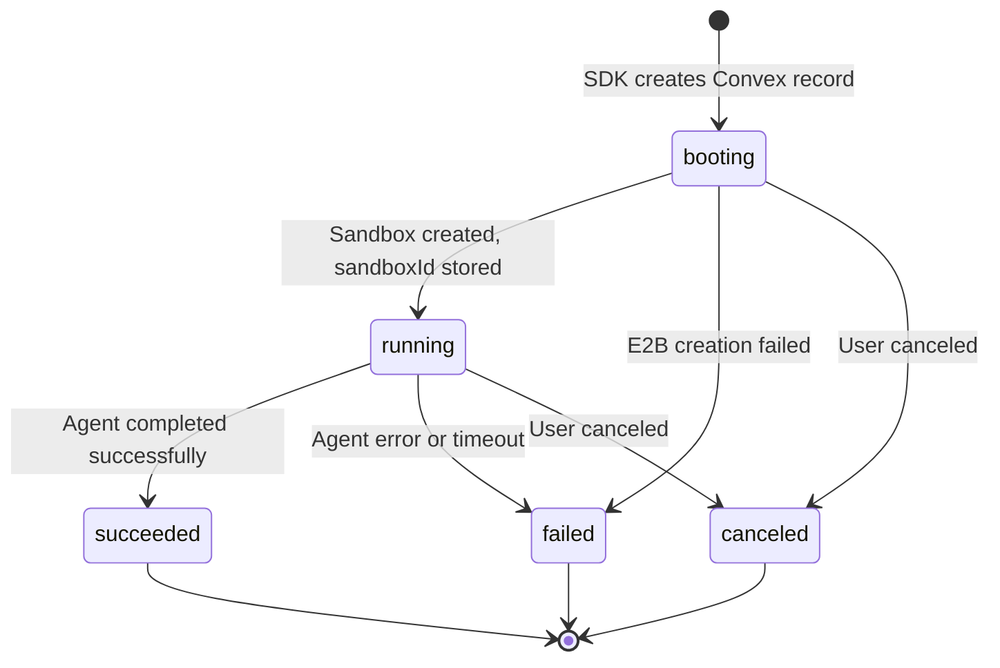

# Fix Integration Gaps: Unify E2B, Convex, Braintrust & Claude Agent SDK

## Overview

This plan addresses the fundamental integration gaps in the Claude Agent SDK boilerplate where four key dependencies (E2B, Convex, Braintrust, Claude Agent SDK) operate in silos instead of working seamlessly together.

**Core Problem**: The boilerplate has three independent sandbox management modes that don't communicate:

| Mode | Executes Agents | Streams Results | Tracks Costs | Persists to Convex | Cron Cleanup |
|------|----------------|-----------------|--------------|-------------------|--------------|
| **Ephemeral** (SDK) | ✅ | ✅ | ✅ | ❌ | ❌ |
| **Managed** (Convex) | ❌ | ❌ | ❌ | ✅ | ✅ |
| **Sessions** | ✅ | ✅ | ✅ | ❌ | Process-local |

**Goal**: Single code path that optionally integrates all systems seamlessly.

---

## Problem Statement

### Gap 1: SDK Functions Bypass Convex Entirely
- `runPythonAgent()`, `runPythonAgentStreaming()` execute agents but never create Convex records
- Cost tracking flows to Braintrust only, never persists for analytics
- Sandboxes created by SDK are invisible to cron cleanup

### Gap 2: Convex Actions Don't Execute Agents
- `startSandboxRun` creates infrastructure but never runs Python agents
- Returns `sandboxId` but user must implement execution themselves
- No streaming, no cost tracking, no observability

### Gap 3: Sessions Are Undocumented Third Mode
- In-memory `Map<string, ConversationSession>` state
- Lost on process restart
- No Convex registration for proper cleanup

### Gap 4: Artifacts Table Is Dead Infrastructure
- Schema exists in `convex/schema.ts`
- CRUD mutations exist in `convex/artifacts.ts`
- Nothing ever populates it

### Gap 5: Cost Tracking Never Persists
- Calculated in `examples/lib/cost-tracking.ts`
- Logged to Braintrust spans
- Convex schema has no cost fields

### Gap 6: Duplicate Code and Constants
- `TokenUsage` interface defined twice with different naming
- `DEFAULT_ALLOWED_TOOLS` defined in two files
- Constants split between `examples/lib/constants.ts` and `convex/lib/constants.ts`

---

## Proposed Solution

### Unified Interface

Make Convex registration **optional** in SDK functions:

```typescript
const result = await runPythonAgent({
  prompt: 'Your task',
  timeout: 120,
  verbose: true,
  // NEW: Optional Convex integration
  convex: {
    client: convexClient,
    workspaceId: Id<"workspaces">,
    threadId?: string,
    persistArtifacts?: boolean,
  }
})
```

**Behavior**:
- When `convex` is omitted → Pure ephemeral mode (current behavior, unchanged)
- When `convex` is provided → Managed mode with full lifecycle tracking

---

## Technical Approach

### Architecture

```
┌──────────────────────────────────────────────────────────────────┐
│                     Unified SDK Interface                        │
│  runPythonAgent({ prompt, convex?, observability? })            │
└──────────────────────────────────────────────────────────────────┘
                              │
                              ▼
┌──────────────────────────────────────────────────────────────────┐
│                    Execution Orchestrator                        │
│  - Check if Convex configured                                   │
│  - Initialize observability (Braintrust)                        │
│  - Create sandbox run record if managed mode                    │
└──────────────────────────────────────────────────────────────────┘
                              │
           ┌──────────────────┴──────────────────┐
           ▼                                      ▼
┌─────────────────────┐              ┌─────────────────────┐
│   Ephemeral Path    │              │    Managed Path     │
│  - Direct E2B SDK   │              │  - Convex mutation  │
│  - No persistence   │              │  - State machine    │
│  - Local cleanup    │              │  - Cost persistence │
└─────────────────────┘              └─────────────────────┘
           │                                      │
           └──────────────────┬──────────────────┘
                              ▼
┌──────────────────────────────────────────────────────────────────┐
│                     E2B Sandbox Execution                        │
│  - Create sandbox with metadata (traceId, runId)                │
│  - Execute Python agent                                          │
│  - Stream events via callbacks                                   │
│  - Extract costs and artifacts                                   │
└──────────────────────────────────────────────────────────────────┘
                              │
                              ▼
┌──────────────────────────────────────────────────────────────────┐
│                    Result & Cleanup                              │
│  - Update Convex state (if managed)                             │
│  - Log to Braintrust (if configured)                            │
│  - Kill sandbox (always)                                         │
│  - Return result to caller                                       │
└──────────────────────────────────────────────────────────────────┘
```

### State Machine (Managed Mode)



---

## Implementation Phases

### Phase 1: Foundation (Unblock Integration)

**Goal**: Create the infrastructure for optional Convex integration without breaking existing code.

#### Task 1.1: Add Cost Fields to Convex Schema
**File**: `convex/schema.ts`
**Changes**:
```typescript
sandboxRuns: defineTable({
  // ... existing fields
  // NEW: Cost tracking
  cost: v.optional(v.object({
    claudeCost: v.number(),
    e2bCost: v.number(),
    totalCost: v.number(),
  })),
  tokenUsage: v.optional(v.object({
    inputTokens: v.number(),
    outputTokens: v.number(),
    cachedTokens: v.optional(v.number()),
  })),
  durationMs: v.optional(v.number()),
  // NEW: Observability link
  braintrustTraceId: v.optional(v.string()),
})
```

#### Task 1.2: Consolidate Constants
**Files**:
- `examples/lib/constants.ts`
- `convex/lib/constants.ts`

**Action**: Create shared constants and re-export from both locations for backward compatibility.

#### Task 1.3: Unify TokenUsage Interface
**Files**:
- `examples/lib/streaming.ts` (snake_case)
- `examples/lib/cost-tracking.ts` (camelCase)

**Action**: Standardize on camelCase, add conversion functions for Python output.

#### Task 1.4: Create Convex Integration Module
**New File**: `examples/lib/convex-integration.ts`
**Purpose**: Client wrapper with typed mutations for SDK use.

```typescript
export interface ConvexConfig {
  client: ConvexClient
  workspaceId: Id<"workspaces">
  threadId?: string
  persistArtifacts?: boolean
}

export async function createSandboxRunRecord(
  config: ConvexConfig,
  prompt: string,
  traceId?: string
): Promise<Id<"sandboxRuns">>

export async function updateSandboxRunStatus(
  config: ConvexConfig,
  runId: Id<"sandboxRuns">,
  status: SandboxStatus,
  data?: Partial<SandboxRunUpdate>
): Promise<void>

export async function persistCostData(
  config: ConvexConfig,
  runId: Id<"sandboxRuns">,
  cost: CostBreakdown
): Promise<void>
```

---

### Phase 2: Core Integration (SDK + Convex)

**Goal**: Modify SDK functions to optionally register with Convex.

#### Task 2.1: Extend AgentConfig Interface
**File**: `examples/lib/agent.ts`
**Changes**:
```typescript
export interface AgentConfig {
  prompt: string
  timeout?: number
  verbose?: boolean
  observability?: ObservabilityConfig
  onStream?: StreamCallbacks
  // NEW
  convex?: ConvexConfig
}
```

#### Task 2.2: Implement Managed Mode in runPythonAgent
**File**: `examples/lib/agent.ts`
**Changes**:
- Before sandbox creation: Create Convex record if configured
- After sandbox creation: Store sandboxId in Convex record
- On completion: Update status, persist costs
- On error: Update status with error details
- Always: Kill sandbox in finally block

**Key Logic**:
```typescript
export async function runPythonAgent(config: AgentConfig): Promise<string> {
  const { prompt, convex } = config

  let sandboxRunId: Id<"sandboxRuns"> | null = null

  // Create Convex record if managed mode
  if (convex) {
    sandboxRunId = await createSandboxRunRecord(convex, prompt, traceContext?.traceId)
  }

  const sandbox = await Sandbox.create(templateId, { ... })

  // Store sandboxId immediately (for cron cleanup)
  if (convex && sandboxRunId) {
    await updateSandboxRunStatus(convex, sandboxRunId, 'running', {
      sandboxId: sandbox.sandboxId,
      lastActivityAt: Date.now(),
    })
  }

  try {
    const result = await executeAgent(sandbox, prompt, config)

    if (convex && sandboxRunId) {
      await updateSandboxRunStatus(convex, sandboxRunId, 'succeeded', {
        result: result.substring(0, 10000), // Truncate for storage
        finishedAt: Date.now(),
      })
      await persistCostData(convex, sandboxRunId, calculatedCost)
    }

    return result
  } catch (error) {
    if (convex && sandboxRunId) {
      await updateSandboxRunStatus(convex, sandboxRunId, 'failed', {
        error: { message: error.message, code: categorizeError(error) },
        finishedAt: Date.now(),
      })
    }
    throw error
  } finally {
    await sandbox.kill()
  }
}
```

#### Task 2.3: Implement Managed Mode in runPythonAgentStreaming
**File**: `examples/lib/agent.ts`
**Changes**: Same pattern as 2.2 but with streaming callbacks updating `lastActivityAt`.

#### Task 2.4: Add Activity Heartbeat for Long-Running Tasks
**Purpose**: Prevent cron from killing active sandboxes.
**Implementation**: Update `lastActivityAt` on each streaming event (throttled to every 30s).

---

### Phase 3: Sessions Integration

**Goal**: Allow sessions to register with Convex for proper lifecycle management.

#### Task 3.1: Extend Session Config
**File**: `examples/lib/sessions.ts`
**Changes**:
```typescript
export interface SessionConfig {
  timeout?: number
  // NEW
  convex?: ConvexConfig
}
```

#### Task 3.2: Create Session Records in Convex
**Decision**: Each session creates ONE sandboxRuns record with `sessionMode: true`.
**Rationale**: Multi-turn sessions share one sandbox; tracking per-turn would create orphaned records.

#### Task 3.3: Update Session on Each Turn
**Changes**: `sendMessage()` updates `lastActivityAt` and aggregates token usage.

#### Task 3.4: Handle Session Cleanup
**Changes**: `endSession()` updates status to `succeeded` and persists final costs.

---

### Phase 4: Artifacts Implementation

**Goal**: Capture and persist sandbox filesystem artifacts.

#### Task 4.1: Design Artifact Capture
**Mechanism**:
1. After agent completes, scan `/workspace/output` directory
2. Filter by size (max 10MB per file, 50MB total)
3. Read file contents via `sandbox.files.read()`
4. Create Convex artifact records

#### Task 4.2: Implement Artifact Scanner
**New File**: `examples/lib/artifacts.ts`
```typescript
export interface ArtifactConfig {
  outputDir?: string  // Default: /workspace/output
  maxFileSize?: number  // Default: 10MB
  maxTotalSize?: number  // Default: 50MB
  allowedExtensions?: string[]  // Default: all
}

export async function captureArtifacts(
  sandbox: Sandbox,
  config: ArtifactConfig
): Promise<CapturedArtifact[]>
```

#### Task 4.3: Persist Artifacts to Convex
**File**: `convex/artifacts.ts`
**Changes**: Add internal mutation for SDK to create artifacts with proper authorization.

#### Task 4.4: Connect to SDK Flow
**File**: `examples/lib/agent.ts`
**Changes**: After successful completion, if `persistArtifacts: true`, capture and persist.

---

### Phase 5: Observability Unification

**Goal**: Link Braintrust traces to Convex records for full observability.

#### Task 5.1: Store Trace ID in Convex
**Changes**: When creating sandboxRuns record, store `braintrustTraceId` if available.

#### Task 5.2: Add Trace URL to Results
**Changes**: Return `traceUrl` in result object for easy debugging.

#### Task 5.3: Dual Persistence of Costs
**Behavior**:
- Always log to Braintrust span (source of truth for debugging)
- Also persist to Convex (source of truth for analytics/billing)

---

### Phase 6: Cleanup and Polish

#### Task 6.1: Remove Dead Code
- Delete unused artifacts mutations that reference old schema
- Clean up `startSandboxRun` action (either enhance or remove)

#### Task 6.2: Update CLAUDE.md
- Document unified mode
- Add examples for Convex integration
- Update architecture diagram

#### Task 6.3: Add Integration Tests
**New File**: `examples/test_convex_integration.ts`
- Test ephemeral mode still works
- Test managed mode creates records
- Test cost persistence
- Test artifact capture

#### Task 6.4: Migrate runPythonAgentDetailed to Templates
**File**: `examples/lib/agent.ts`
**Changes**: Use `generatePythonAgentCode()` instead of inline Python.

---

## Acceptance Criteria

### Functional Requirements

- [ ] Existing code without `convex` option works identically (backward compatible)
- [ ] With `convex` option, sandboxRuns records are created and tracked
- [ ] Cost data persists to Convex when configured
- [ ] Sessions can optionally register with Convex
- [ ] Artifacts captured from `/workspace/output` when `persistArtifacts: true`
- [ ] Braintrust trace IDs stored in Convex for correlation
- [ ] Cron cleanup respects `lastActivityAt` for active sandboxes

### Non-Functional Requirements

- [ ] No breaking changes to existing SDK API
- [ ] Convex writes don't block agent execution (fire-and-forget with error logging)
- [ ] Activity heartbeat throttled to prevent Convex rate limiting
- [ ] Artifact capture respects size limits

### Quality Gates

- [ ] All existing examples still work
- [ ] New integration tests pass
- [ ] UBS scan passes on all modified files
- [ ] CLAUDE.md updated with new patterns

---

## Dependencies & Prerequisites

### External Dependencies
- Convex backend deployed with updated schema
- E2B template unchanged
- Braintrust API key (optional)

### Internal Dependencies
| Task | Depends On |
|------|------------|
| 2.1-2.4 (SDK Integration) | 1.1-1.4 (Foundation) |
| 3.1-3.4 (Sessions) | 2.1-2.4 |
| 4.1-4.4 (Artifacts) | 1.1, 2.2 |
| 5.1-5.3 (Observability) | 2.2 |
| 6.1-6.4 (Cleanup) | All above |

---

## Risk Analysis & Mitigation

### Risk 1: Convex Write Failures Break Agent Execution
**Mitigation**: Wrap all Convex calls in try/catch, log errors but continue execution.
```typescript
try {
  await updateSandboxRunStatus(...)
} catch (error) {
  console.error('Convex update failed, continuing:', error)
  // Don't rethrow - agent execution should succeed even if persistence fails
}
```

### Risk 2: Cron Kills Active Long-Running Sandboxes
**Mitigation**: Activity heartbeat updates `lastActivityAt` on streaming events.

### Risk 3: Artifact Capture Overwhelms Storage
**Mitigation**: Strict size limits (10MB/file, 50MB total), configurable allow-list.

### Risk 4: Breaking Changes to Existing Code
**Mitigation**: `convex` parameter is optional, defaults to undefined, behavior unchanged when absent.

### Risk 5: Race Condition Between SDK and Cron
**Mitigation**: Cron checks `lastActivityAt` with buffer (15 min idle, not 15 min since creation).

---

## Success Metrics

1. **Integration Coverage**: All 4 systems connected in single code path
2. **Backward Compatibility**: Zero breaking changes to existing API
3. **Cost Visibility**: 100% of managed runs have cost data in Convex
4. **Orphan Reduction**: Cron can clean up all sandbox types
5. **Developer Experience**: Single config option enables full lifecycle tracking

---

## File References

### Core SDK (to modify)
- `/Users/harrisonwells/claude-agent-sdk-experiments/examples/lib/agent.ts`
- `/Users/harrisonwells/claude-agent-sdk-experiments/examples/lib/streaming.ts`
- `/Users/harrisonwells/claude-agent-sdk-experiments/examples/lib/sessions.ts`
- `/Users/harrisonwells/claude-agent-sdk-experiments/examples/lib/cost-tracking.ts`
- `/Users/harrisonwells/claude-agent-sdk-experiments/examples/lib/constants.ts`

### Convex Backend (to modify)
- `/Users/harrisonwells/claude-agent-sdk-experiments/convex/schema.ts`
- `/Users/harrisonwells/claude-agent-sdk-experiments/convex/sandboxRuns.ts`
- `/Users/harrisonwells/claude-agent-sdk-experiments/convex/artifacts.ts`
- `/Users/harrisonwells/claude-agent-sdk-experiments/convex/lib/constants.ts`

### New Files (to create)
- `/Users/harrisonwells/claude-agent-sdk-experiments/examples/lib/convex-integration.ts`
- `/Users/harrisonwells/claude-agent-sdk-experiments/examples/lib/artifacts.ts`
- `/Users/harrisonwells/claude-agent-sdk-experiments/examples/test_convex_integration.ts`

### Documentation (to update)
- `/Users/harrisonwells/claude-agent-sdk-experiments/CLAUDE.md`

---

## Open Questions (Require Decision)

### Q1: Session State - One Record or Many?
**Recommendation**: One sandboxRuns record per session (not per turn).
**Rationale**: Sessions share one sandbox; per-turn records would orphan on crash.

### Q2: Convex Write Failure Behavior
**Recommendation**: Log and continue (don't fail the agent execution).
**Rationale**: Agent result is valuable even if persistence fails.

### Q3: Artifact Capture Trigger
**Recommendation**: Explicit `persistArtifacts: true` flag, not automatic.
**Rationale**: Many runs don't produce artifacts; scanning is expensive.

### Q4: Cost Tracking Source of Truth
**Recommendation**: Braintrust for debugging, Convex for analytics/billing.
**Rationale**: Braintrust has full traces; Convex is queryable for aggregation.

---

## References

### Internal
- Existing plan: `/Users/harrisonwells/claude-agent-sdk-experiments/plans/unify-sdk-convex-architecture.md`
- TODO #002: Orphaned E2B Sandboxes
- TODO #003: Dual State Management (documented)
- TODO #004: Python Code Duplication

### External
- [E2B Sandbox Lifecycle](https://e2b.dev/docs/sandbox)
- [Convex Actions Best Practices](https://docs.convex.dev/functions/actions)
- [Braintrust Trace Customization](https://www.braintrust.dev/docs/guides/traces/customize)
- [Claude Agent SDK Reference](https://platform.claude.com/docs/en/agent-sdk/python)
